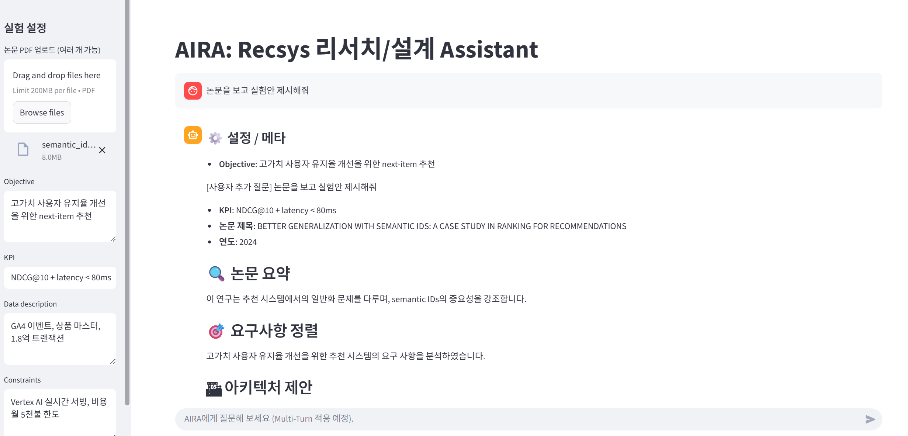

# AIRA: AI Research Assistant for recommender systems

LangGraph 기반의 리서치/설계 에이전트로, 논문 PDF와 비즈니스/데이터 요구사항을 받아 추천 시스템 아키텍처 및 실험 로드맵을 자동 제안

## 주요 기능
- 논문 PDF 자동 로딩 및 청크 분할, 핵심 요약
- KPI·제약과 연구 인사이트 정렬
- 오프라인+실시간 추천 아키텍처 설계
- 베이스라인 및 A/B 실험 계획 생성

## 빠른 시작
1. 의존성 설치
   ```bash
   python -m venv .venv
   source .venv/bin/activate
   pip install -r requirements.txt
   pip install -e .
   ```
2. OpenAI 키를 환경 변수로 설정 (`.env` 사용 가능). 키가 없으면 실행 중단
   ```bash
   export OPENAI_API_KEY=sk-...
   ```
3. 실행 예시
   ```bash
   python scripts/run_agent.py \
     --pdf /path/to/survey.pdf /path/to/model_paper.pdf \
     --objective "고가치 사용자 유지율 개선을 위한 next-item 추천" \
     --kpi "NDCG@10 + latency < 80ms" \
     --data "GA4 이벤트, 상품 마스터, 1.8억 트랜잭션" \
     --constraints "Vertex AI 실시간 서빙, 비용 월 5천불 한도"
   ```

## 코드 개요
- `src/aira/graph.py`: LangGraph 스테이트 그래프 정의. 단계별 노드(논문 요약 → 요구사항 정렬 → 아키텍처 설계 → 실험 계획)를 통해 결과를 합성
- `scripts/run_agent.py`: CLI 엔트리 포인트. 입력 인자를 받아 `ResearchAgent`를 실행하고 JSON으로 결과 출력

## 출력 예시


## 향후 확장 아이디어
- Multi-Turn 확장 (예정)
- Graph RAG 기반 논문 온톨로지 구축
- SQL/노트북 실행 툴 연동으로 자동 베이스라인 생성
- 평가 보고서 템플릿 자동 생성 및 대시보드 연동

